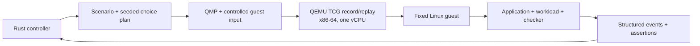

# SimFerret

SimFerret is an experimental deterministic simulation platform for finding and
reproducing failures in unmodified software.

The project is currently in design and proof-of-concept development. See the
[Requests for Discussion](rfd/README.adoc) for architecture decisions and
implementation plans.

## Architecture



Rust owns scenario choices, VM lifecycle, artifacts, event normalization, and
assertions. QEMU owns deterministic machine execution and its replay log. All
guest-affecting host input crosses a recorded boundary; uncontrolled network,
host filesystems, entropy, and wall clocks are outside the initial replay
contract. [RFD 1](rfd/0001/README.adoc) records the architecture and
defines the bounded echo/restart proof of concept.

## QEMU replay spike

Phase 0 boots a repository-built initramfs with the pinned Linux kernel and
QEMU, records one fixed guest action, replays it twice, and compares the serial
output byte for byte. It is intentionally diskless and has no network device.

On x86-64 Linux:

```shell
.agents/dev ./scripts/qemu-replay-smoke.sh
```

Each invocation writes a fresh run directory under `.poc/qemu-replay-smoke/`
without deleting earlier evidence. This spike validates the execution-engine
boundary only; it does not yet implement the Rust controller, guest agent,
process restart, or scenario assertions.

## Record path

On x86-64 Linux, build the static guest/controller executable and record the
bounded network-outage scenario with:

```shell
.agents/dev cargo build --release --target x86_64-unknown-linux-musl
.agents/dev ./target/x86_64-unknown-linux-musl/release/simferret run \
  --scenario scenarios/echo-process-restart.toml --seed 42
```

The command boots the executable as PID 1 in a fixed one-vCPU QEMU TCG guest,
configures its RTL8139 NIC, fetches materialized TFTP fixtures through QEMU's
restricted replay-filtered backend, activates and restores the seed-planned
peer-specific outage, and evaluates structured assertions. A successful run
prints its identifier, assertion result, artifact directory, and replay command.
Complete runs are atomically published under `runs/`; incomplete staging
directories are removed when the controller unwinds normally. Abrupt
termination can leave hidden temporary directories that require manual removal.
The replay identity guarantee assumes the documented pinned, immutable Nix
QEMU, kernel, modules, BusyBox, and firmware inputs; mutable environment
overrides are outside the contract.

## Phase 3 replay path

Replay a completed run with the same pinned environment and executable:

```shell
.agents/dev ./target/x86_64-unknown-linux-musl/release/simferret replay \
  runs/<run-id>
```

Before QEMU starts, replay validates the manifest, every artifact digest, the
materialized choice plan, the rebuilt initial state, and the complete VM
identity. Record-mode commands cross QEMU's replay-aware second ISA serial port
as line-delimited JSON, paced by a guest acknowledgement for every byte so
deferred replay events cannot overrun the UART. Replay sends no host commands:
QEMU injects the recorded serial input from an isolated replay-log copy. The
controller validates and compares each normalized event as it arrives, then
requires byte-identical event and assertion artifacts and a matching semantic
outcome digest. Divergence reports the first differing, missing, or surplus
event. Dependency, preflight, runtime, and publication failures retain an
atomically published diagnostic bundle under `runs/failures/`. Its
`failure.json` records the validated local network identity when available,
record or passive-replay backend mode, completed fault transitions, semantic
traffic counts, and the explicit unavailability of packet counters in the
selected QEMU backend. Error text and sanitized QEMU and guest log tails are
each capped at 64 KiB. Report-only preflight bundles never read unvalidated run
logs.

## Phase 4 acceptance

Run the complete proof-of-concept acceptance demonstration on x86-64 Linux:

```shell
.agents/dev ./scripts/phase4-acceptance.sh
```

The command builds the static guest/controller, records the seed-42 restart
scenario, verifies its bounded outage, replays it twice, rejects artifact and
VM-identity tampering, and records a seed-43 intentionally corrupt scenario.
It requires the second seed to produce a different choice plan and requires the
corrupt fixture to fail safety with CLI status 1. A fresh evidence directory,
including durations, sizes, digests, command output, and diagnostics, is kept
under `.poc/phase4-acceptance/`. CI runs the same command on Ubuntu.

## Network replay spike

The RFD 2 Phase 0 spike adds an explicit RTL8139 NIC with its option ROM
disabled, restricted QEMU user networking, and a mandatory replay filter. It
fetches content across the NIC, proves a peer-specific administrative outage,
restores connectivity, passively replays the run twice after removing fixture
content, and verifies that corrupted network-returned content fails its safety
property.

On x86-64 Linux, run:

```shell
.agents/dev ./scripts/qemu-network-replay-smoke.sh
```

The command builds a deterministic initramfs containing the pinned static
BusyBox and matching guest-kernel `mii` and `8139cp` modules. It preserves
durations, identities, digests, serial output, and QEMU diagnostics under
`.poc/qemu-network-replay-smoke/`. Set `SIMFERRET_NETWORK_REQUESTS` from 1
through 1000 for bounded traffic-scaling experiments.

## RFD 2 network scenario

The proof-of-concept scenario, choice-plan, and guest protocols remain at
version 1. The seeded choice plan records
separate request indexes for outage activation and restoration. The controller
materializes one canonical TFTP file per request, and the guest fetches those
bytes through the RTL8139 NIC from the restricted QEMU backend. Guest commands
configure the fixed address, install and confirm `prohibit 10.0.2.2/32`, then
remove and confirm that route. Structured events distinguish an administrative
`EACCES` from transport and response-format failures.

The assertion report covers a matching pre-outage response, bounded typed
outage, confirmed restoration, and bounded matching recovery. The regular
record command shown above now runs this network scenario; the corrupt scenario
still publishes evidence but exits with status 1 after receiving mismatched
fixture content across the NIC. Phase 3 validates this complete identity and
choice plan before launch, uses an empty adapter-owned TFTP directory for
passive replay, and verifies normalized events, assertion bytes, and the
semantic outcome digest on every replay.

## Development

The Nix flake provides the pinned Rust toolchain and Jujutsu. On an x86-64 Linux
Amp orb, run `.agents/setup` once to install Nix when needed and initialize a
colocated Jujutsu repository. On aarch64 Linux and macOS, install
Nix separately, then run `.agents/setup` to fetch dependencies and initialize
Jujutsu. To enter the environment directly, run
`nix --extra-experimental-features 'nix-command flakes' develop`.

Run repository commands through the development environment:

```shell
make check-rfds
nix --extra-experimental-features 'nix-command flakes' flake check
.agents/dev cargo fmt --all -- --check
.agents/dev cargo clippy --locked --workspace --all-targets --all-features -- --deny warnings
.agents/dev cargo test --locked --workspace --all-targets --all-features
bash -n .agents/dev .agents/setup scripts/*.sh
.agents/dev jj status
```
