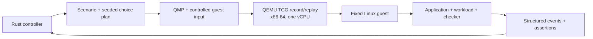

# SimFerret

SimFerret is an experimental deterministic simulation platform for finding and
reproducing failures in unmodified software.

The project is currently in design and proof-of-concept development. See the
[Requests for Discussion](rfd/README.adoc) for architecture decisions and
implementation plans.

## Architecture



Rust owns scenario choices, VM lifecycle, artifacts, event normalization, and
assertions. QEMU owns deterministic machine execution and its replay log. All
guest-affecting host input crosses a recorded boundary; uncontrolled network,
host filesystems, entropy, and wall clocks are outside the initial replay
contract. [RFD 1](rfd/0001/README.adoc) records the architecture and
defines the bounded echo/restart proof of concept.

## QEMU replay spike

Phase 0 boots a repository-built initramfs with the pinned Linux kernel and
QEMU, records one fixed guest action, replays it twice, and compares the serial
output byte for byte. It is intentionally diskless and has no network device.

On x86-64 Linux:

```shell
.agents/dev ./scripts/qemu-replay-smoke.sh
```

Each invocation writes a fresh run directory under `.poc/qemu-replay-smoke/`
without deleting earlier evidence. This spike validates the execution-engine
boundary only; it does not yet implement the Rust controller, guest agent,
process restart, or scenario assertions.

## Record path

On x86-64 Linux, build the static guest/controller executable and record the
bounded network-outage scenario with:

```shell
.agents/dev cargo build --release --target x86_64-unknown-linux-musl
.agents/dev ./target/x86_64-unknown-linux-musl/release/simferret run \
  --scenario scenarios/echo-process-restart.toml --seed 42
```

The command boots the executable as PID 1 in a fixed one-vCPU QEMU TCG guest,
configures its RTL8139 NIC, fetches materialized TFTP fixtures through QEMU's
restricted replay-filtered backend, activates and restores the seed-planned
peer-specific outage, and evaluates structured assertions. A successful run
prints its identifier, assertion result, artifact directory, and replay command.
Complete runs are atomically published under `runs/`; incomplete staging
directories are removed when the controller unwinds normally. Abrupt
termination can leave hidden temporary directories that require manual removal.
The replay identity guarantee assumes the documented pinned, immutable Nix
QEMU, kernel, modules, BusyBox, and firmware inputs; mutable environment
overrides are outside the contract.

## Phase 3 replay path

Replay a completed run with the same pinned environment and executable:

```shell
.agents/dev ./target/x86_64-unknown-linux-musl/release/simferret replay \
  runs/<run-id>
```

Before QEMU starts, replay validates the manifest, every artifact digest, the
materialized choice plan, the rebuilt initial state, and the complete VM
identity. Record-mode commands cross QEMU's replay-aware second ISA serial port
as line-delimited JSON, paced by a guest acknowledgement for every byte so
deferred replay events cannot overrun the UART. Replay sends no host commands:
QEMU injects the recorded serial input from an isolated replay-log copy. The
controller validates and compares each normalized event as it arrives, then
requires byte-identical event and assertion artifacts and a matching semantic
outcome digest. Divergence reports the first differing, missing, or surplus
event. Dependency, preflight, runtime, and publication failures retain an
atomically published diagnostic bundle under `runs/failures/`. Its
`failure.json` records the validated local network identity when available,
record or passive-replay backend mode, completed fault transitions, semantic
traffic counts, and the explicit unavailability of packet counters in the
selected QEMU backend. Error text and sanitized QEMU and guest log tails are
each capped at 64 KiB. Report-only preflight bundles never read unvalidated run
logs.

## Phase 4 acceptance

Run the complete proof-of-concept acceptance demonstration on x86-64 Linux:

```shell
.agents/dev ./scripts/phase4-acceptance.sh
```

The command builds the static guest/controller, records the seed-42 restart
scenario, verifies its bounded outage, replays it twice, rejects artifact and
VM-identity tampering, and records a seed-43 intentionally corrupt scenario.
It requires the second seed to produce a different choice plan and requires the
corrupt fixture to fail safety with CLI status 1. A fresh evidence directory,
including durations, sizes, digests, command output, and diagnostics, is kept
under `.poc/phase4-acceptance/`. CI runs the same command on Ubuntu.

## Network replay spike

The RFD 2 Phase 0 spike adds an explicit RTL8139 NIC with its option ROM
disabled, restricted QEMU user networking, and a mandatory replay filter. It
fetches content across the NIC, proves a peer-specific administrative outage,
restores connectivity, passively replays the run twice after removing fixture
content, and verifies that corrupted network-returned content fails its safety
property.

On x86-64 Linux, run:

```shell
.agents/dev ./scripts/qemu-network-replay-smoke.sh
```

The command builds a deterministic initramfs containing the pinned static
BusyBox and matching guest-kernel `mii` and `8139cp` modules. It preserves
durations, identities, digests, serial output, and QEMU diagnostics under
`.poc/qemu-network-replay-smoke/`. Set `SIMFERRET_NETWORK_REQUESTS` from 1
through 1000 for bounded traffic-scaling experiments.

## RFD 2 network scenario

The proof-of-concept scenario, choice-plan, and guest protocols remain at
version 1. The seeded choice plan records
separate request indexes for outage activation and restoration. The controller
materializes one canonical TFTP file per request, and the guest fetches those
bytes through the RTL8139 NIC from the restricted QEMU backend. Guest commands
configure the fixed address, install and confirm `prohibit 10.0.2.2/32`, then
remove and confirm that route. Structured events distinguish an administrative
`EACCES` from transport and response-format failures.

The assertion report covers a matching pre-outage response, bounded typed
outage, confirmed restoration, and bounded matching recovery. The regular
record command shown above now runs this network scenario; the corrupt scenario
still publishes evidence but exits with status 1 after receiving mismatched
fixture content across the NIC. Phase 3 validates this complete identity and
choice plan before launch, uses an empty adapter-owned TFTP directory for
passive replay, and verifies normalized events, assertion bytes, and the
semantic outcome digest on every replay.

## RFD 3 workload packaging spike

The RFD 3 Phase 0 spike packages an external executable instead of the built-in
fixture. It compiles one static and one dynamically linked workload, builds
local OCI image layouts that carry them, applies representative base and upper
layers twice into one stable canonical filesystem digest, normalizes every
source into a content-addressed store, deletes each live source before QEMU
starts, and records and passively replays each workload through one guest
supervisor. The dynamic workload runs from the loader and shared library inside
its own image; no registry, container daemon, or host mount is used.

On x86-64 Linux:

```shell
.agents/dev ./scripts/rfd3-phase0-spike.sh
```

Each invocation writes a fresh run directory under `.poc/rfd3-phase0-spike/`
with the stores, guest images, serial logs, replay logs, and an `evidence.txt`
summary. This spike validates the packaging boundary only; the typed workload
specification, canonical Rust assembler, and guest process protocol are Phase 1
and Phase 2 work.

The focused regression command is:

```shell
.agents/dev ./scripts/rfd3-phase0-spike-test.sh
```

The suite also runs the guest supervisor's cleanup path as PID 1 of a private PID
namespace, which needs unprivileged user namespaces or passwordless `sudo`; the
test reports which one it used and fails if neither is available.

## RFD 3 workload specification and canonical assembler

The RFD 3 Phase 1 assembler replaces the Phase 0 prototype with a typed,
versioned workload specification and a bounded canonical normalizer. A workload
is one of two tagged source forms:

```toml
version = 1
kind = "binary"
path = "bin/example-server"
args = ["--listen", "0.0.0.0:8080"]
env = ["MODE=acceptance"]
working_directory = "/"
user = "1000:1000"
```

```toml
version = 1
kind = "oci"
layout = "images/example"
manifest_digest = "sha256:<digest>"
```

Source locators resolve relative to the specification and are operational only,
and every locator component is traversed through one opened specification
directory descriptor, so a symlinked component is refused. A binary source must
be a fixed-address static executable: a relocated (static PIE) image is refused,
because its load base, entry address, and mapping alignment are chosen by the
guest loader, so link with `-no-pie` or package the same bytes as an OCI source.
Both forms produce
one canonical filesystem tree, one normalized launch identity, one raw
content-addressed replay closure, and one encoded immutable guest template
rooted at `/workload`. The OCI profile selects exactly one direct `linux/amd64`
image manifest, validates every selected descriptor size and SHA-256 digest
before parsing, applies plain or gzip layers beneath the opened layout directory
with OCI whiteout and opaque-directory semantics, and rejects unsupported media
types, hard links, devices, setuid modes, absolute or escaping paths, unsafe
links, and every configured limit overflow before any output is published. The
template emits the root directory first, because initramfs extraction does not
create missing parents.

```shell
.agents/dev ./target/x86_64-unknown-linux-musl/release/simferret workload assemble \
  --specification workloads/example-binary.toml --store stores/example
.agents/dev ./target/x86_64-unknown-linux-musl/release/simferret workload verify \
  stores/example
```

Assembly writes raw objects and the derived tree, template, and lock through
private staging, creates store directories and files owner-only, and publishes
the raw closure last so a failure never commits a closure without the derived
entry it names. A store path that already exists with group or other access, or
that belongs to another user, is refused instead of reused, so assembly never
adopts a directory other users can write to. Verification re-derives the
canonical tree from the verified raw closure, re-enforces the canonical bounds,
and rechecks the derived entry, so a derived cache entry alone never satisfies a
replay. A store holds one workload closure; assemble it into a separate store
per workload.

The checked-in evidence command builds the repository fixture as a static
executable and as a local OCI layout, assembles both, and requires one canonical
identity, one template identity, and a reproducible closure:

```shell
.agents/dev ./scripts/rfd3-phase1-evidence.sh
```

Each invocation writes a fresh run directory under `.poc/rfd3-phase1-evidence/`
with the assembly summaries and an `evidence.txt` measurement summary. The
focused regression command is the workspace test suite, which includes the
Phase 1 acceptance tests:

```shell
.agents/dev cargo test --locked --workspace --all-targets --all-features
```

## RFD 3 guest process runtime

The PID-1 agent supervises one packaged workload at a time. The immutable
template is assembled below `/workload`, outside the agent, its tools, and the
runtime scratch space. For every invocation the agent materializes a fresh
writable root under `/run/simferret` from that template, reproduces its canonical
bytes and metadata, and applies the versioned overlay: `/tmp` is an empty
root-owned mode-`01777` directory, `/dev` is root-owned mode `0755`, and
`/dev/null` and `/dev/zero` are mode-`0666` character devices with fixed device
numbers. A package entry at `/tmp` or `/dev` must be a directory and has its
metadata replaced; a non-directory entry below either path collides and is
rejected during assembly, before any template is published, and again by the
runtime before any root is created. A launch executable or working directory the
overlay replacement would invalidate is refused at the same assembly boundary.

The agent never changes its own root. It forks a child that receives only fresh
standard pipes, closes every other inherited descriptor, changes root and then
its in-root working directory, clears supplementary groups, sets `no_new_privs`,
applies the normalized nonzero GID and UID, and executes the exact argument
vector without a shell. A setup failure exits the child before any workload code
runs and is reported as a typed `launch-failed` event.

The versioned process protocol adds `start`, `stdin-write`, `stdin-eof`, and
`terminate`. `stdin-write` carries a strictly contiguous byte offset and bounded
exact bytes; `terminate` is an unconditional `SIGKILL`. While the workload runs
the agent emits bounded stdout and stderr frames with the invocation, the stream,
a per-stream offset, one monotonic cross-stream sequence number, and exact bytes;
the exit record independently reports per-stream totals and SHA-256 digests. A
limit overflow, a non-contiguous offset, and a control or pipe transport failure
are fatal: the invocation is killed and the agent reports an infrastructure
error rather than a workload property. On exit or termination the agent signals
every member of the invocation, reaps until only itself remains, and drains both
pipes to end of file before emitting `cleanup-complete`; a new start is refused
until that barrier completes. The agent reports process and byte facts only, so
application protocol interpretation stays in the host scenario checker.

The focused runtime command builds the test binary and runs it as PID 1 in a
fresh PID namespace, because the runtime changes root, drops credentials, and
creates device nodes, and its guest-wide cleanup barrier must not signal
unrelated host processes:

```shell
sudo env "PATH=$PATH" SIMFERRET_BUSYBOX="$SIMFERRET_BUSYBOX" \
  ./scripts/rfd3-phase2-runtime.sh
```

Selecting the workload in `simferret run`, recording its identity in the run
manifest, driving the live protocol from the scenario checker, and the recorded
passive replay are implemented by the RFD 3 Phase 3 integration below.

## RFD 3 workload scenario and passive replay

`simferret run` accepts an optional `--workload SPECIFICATION`. When it is
present the scenario is parsed as the versioned workload-driven acceptance
scenario and the packaged workload, rather than the agent, originates every
recorded request:

```shell
simferret run \
  --workload workloads/example-binary.toml \
  --scenario scenarios/rfd3-workload-acceptance.toml \
  --seed 42
```

The workload specification and its raw source are normalized and published to a
content-addressed store (`<runs-dir>/.workload-store`) before QEMU starts. The
run manifest and a private owner-only `workload.lock` record the normalized
workload identity, and replay re-derives that identity from the verified raw
closure, so a derived cache entry alone is never enough.

The host checker in `crates/simferret/src/checker.rs` owns application meaning.
It reconstructs each invocation's streams from the recorded output frames, checks
them against the exit record's independently reported totals and digests, matches
the ordered response lines to the recorded input commands, and reports
`process_safety`, `response_integrity`, `controlled_outage`, `restoration`, and
`bounded_recovery`. The acceptance script builds the checked-in fixture once and
packages it as a standalone binary, a converging local OCI layout, and a
dynamically linked OCI layout, then records and passively replays each twice
after deleting the live source:

```shell
./scripts/rfd3-phase3-acceptance.sh
```

## RFD 3 acceptance and evidence

The complete RFD 3 demonstration runs unprivileged on x86-64 Linux:

```shell
.agents/dev ./scripts/rfd3-phase4-acceptance.sh
```

It runs the Phase 3 record-and-two-replay demonstration for the standalone
binary, the converging static OCI layout, and the dynamically linked OCI layout,
then measures assembly cost, proves a distinctive ambient environment value and
the host output path never enter the retained closure, checks that private run
artifacts are owner-only while the shareable failure bundles exclude the recorded
environment value and the exact workload stream bytes, and records the workload
output and traffic volumes. CI runs the same command on GitHub-hosted Ubuntu.

The supported profiles are the RFD's bounded set: a standalone fixed-address,
little-endian x86-64 Linux ELF, or one direct `linux/amd64` manifest selected by
digest from a local OCI image layout with plain or gzip layers and OCI whiteout
and opaque-directory semantics. Relocated (static PIE) binaries, standalone
dynamic binaries, device nodes, sockets, FIFOs, setuid and setgid modes, hard
links, sparse files, ACLs, unsupported extended attributes, descriptor URLs, and
embedded descriptor data are rejected before QEMU starts. No registry, container
daemon, host mount, or network access participates.

The guest-visible conformance check assembles a real OCI layout, encodes the
canonical tree as the guest template, extracts it exactly as the guest initramfs
does, and runs an ordinary workload that reports the modes, owners, modification
times, symbolic links, replacements, whiteouts, and opacity it observes. It
changes root, drops credentials, and creates device nodes, so it runs as PID 1 in
a private PID namespace and needs root:

```shell
.agents/dev cargo build --locked --test rfd3_phase4
.agents/dev sudo --preserve-env=PATH,SIMFERRET_BUSYBOX \
  ./scripts/rfd3-phase4-runtime.sh
```

On GitHub-hosted Ubuntu the runner provides passwordless `sudo`; a self-hosted
runner needs the same, or an equivalent unprivileged path, plus the pinned Nix
environment that provides QEMU, the kernel, BusyBox, the static and dynamic C
compilers, `readelf`, and `python3`. The unprivileged acceptance command needs
only QEMU and the pinned kernel; `scripts/rfd3-phase4-acceptance.sh` records the
conformance result when it is already root and otherwise names the checked-in
runtime command.

## Development

The Nix flake provides the pinned Rust toolchain and Jujutsu. On an x86-64 Linux
Amp orb, run `.agents/setup` once to install Nix when needed and initialize a
colocated Jujutsu repository. On aarch64 Linux and macOS, install
Nix separately, then run `.agents/setup` to fetch dependencies and initialize
Jujutsu. To enter the environment directly, run
`nix --extra-experimental-features 'nix-command flakes' develop`.

Run repository commands through the development environment:

```shell
make check-rfds
nix --extra-experimental-features 'nix-command flakes' flake check
.agents/dev cargo fmt --all -- --check
.agents/dev cargo clippy --locked --workspace --all-targets --all-features -- --deny warnings
.agents/dev cargo test --locked --workspace --all-targets --all-features
bash -n .agents/dev .agents/setup scripts/*.sh
.agents/dev jj status
```
