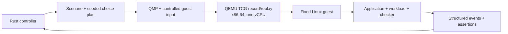

# SimFerret

SimFerret is an experimental deterministic simulation platform for finding and
reproducing failures in unmodified software.

The project is currently in design and proof-of-concept development. See the
[Requests for Discussion](rfd/README.adoc) for architecture decisions and
implementation plans.

## Architecture



Rust owns scenario choices, VM lifecycle, artifacts, event normalization, and
assertions. QEMU owns deterministic machine execution and its replay log. All
guest-affecting host input crosses a recorded boundary; uncontrolled network,
host filesystems, entropy, and wall clocks are outside the initial replay
contract. [RFD 1](rfd/0001/README.adoc) records the architecture and
[RFD 2](rfd/0002/README.adoc) defines the bounded echo/restart proof of concept.

## QEMU replay spike

Phase 0 boots a repository-built initramfs with the pinned Linux kernel and
QEMU, records one fixed guest action, replays it twice, and compares the serial
output byte for byte. It is intentionally diskless and has no network device.

On x86-64 Linux:

```shell
.agents/dev ./scripts/qemu-replay-smoke.sh
```

Artifacts are written to `.poc/qemu-replay-smoke/`. This spike validates the
execution-engine boundary only; it does not yet implement the Rust controller,
guest agent, process restart, or scenario assertions.

## Development

The Nix flake provides the pinned Rust toolchain and Jujutsu. On an x86-64 Linux
Amp orb, run `.agents/setup` once to install Nix when needed and initialize a
colocated Jujutsu repository. On aarch64 Linux and macOS, install
Nix separately, then run `.agents/setup` to fetch dependencies and initialize
Jujutsu. To enter the environment directly, run
`nix --extra-experimental-features 'nix-command flakes' develop`.

Run repository commands through the development environment:

```shell
make check-rfds
nix --extra-experimental-features 'nix-command flakes' flake check
.agents/dev cargo fmt --all -- --check
.agents/dev cargo clippy --locked --workspace --all-targets --all-features -- --deny warnings
.agents/dev cargo test --locked --workspace --all-targets --all-features
bash -n .agents/dev .agents/setup scripts/*.sh
.agents/dev jj status
```
